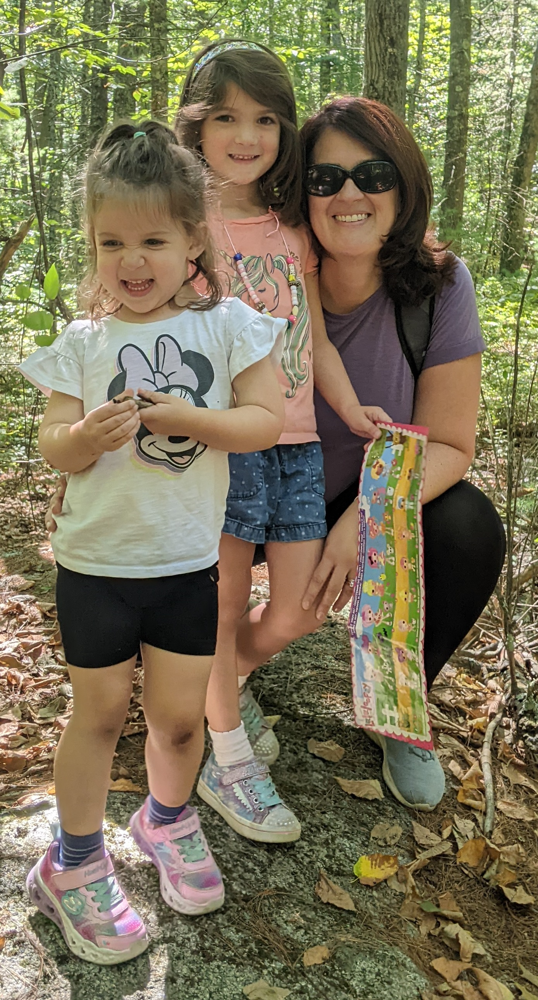

# Here is my primary section header!

We have got some major things to talk about. Thing 1, thing 2 and thing 3.

## Thing 1

Holy Cow! This is Thing 1

## Thing 2

Yikes, this is Thing 2

## Thing 3 

And here is thing three!



```
function logTest () {
  console.log("here comes the grannies!");
}
```

# So...what do we need to do?

- [X] Let's learn about headers and images 
- [X] Add a code block
- [ ] Figure out what parts of this actually would work
